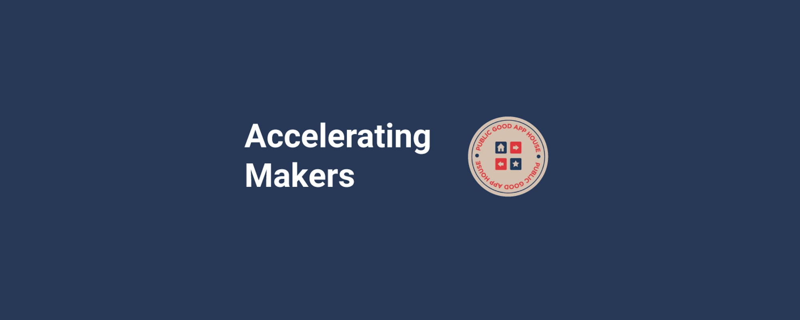

	

---

### DWeb for Impact: Use Case Database

The following Awesome list of non-profit and educational institution Decentralized Web ([DWeb](https://wiki.mozilla.org/Dweb)) use cases, examples solutions, and tools was curated by [Accelerating Makers](https://acceleratingmakers.publicgoodapphouse.org/), a program of Public Good App House and [TechSoup](https://www.techsoup.org/) that is helping technology builders and nonprofits co-create purpose-built tools for public good.

	<a href="awesome.md">What is an awesome list?</a>&nbsp;&nbsp;&nbsp;
	<a href="contributing.md">Contribution guide</a>&nbsp;&nbsp;&nbsp;
	<a href="create-list.md">Creating a list</a>&nbsp;&nbsp;&nbsp;
	<a href="https://twitter.com/awesome__re">Twitter</a>&nbsp;&nbsp;&nbsp;

---

 
 

## Contents

[Non-Profit and Educational Institution DWeb Use Cases](dweb_use_cases.md)

[DWeb Projects / Example Solutions](dweb_projects_examples.md)

---

## Join The Online Community - Quad

Go deeper with an online community of Makers and Civil Society Leaders co-creating purpose-built tools for public good. This is our opportunity to take ownership of the digital landscape, rebuild the systems that civil society uses to make change, and drive positive impact.

### [Register Here to Join Quad](https://survey.alchemer.com/s3/7572582/Accelerating-Makers-Community-Registration)

---

 This project is supported by an award from [Filecoin Foundation for the Decentralized Web](https://ffdweb.org/)
